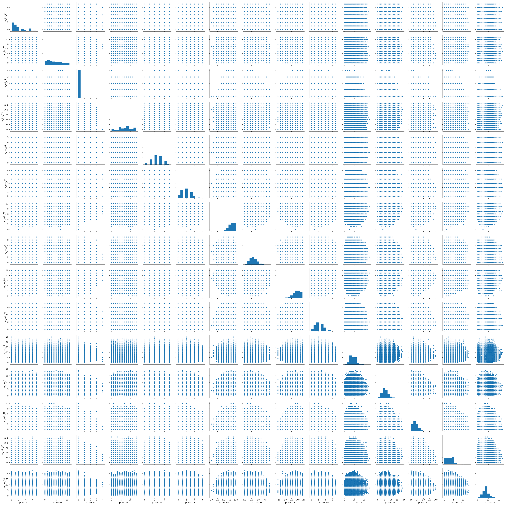
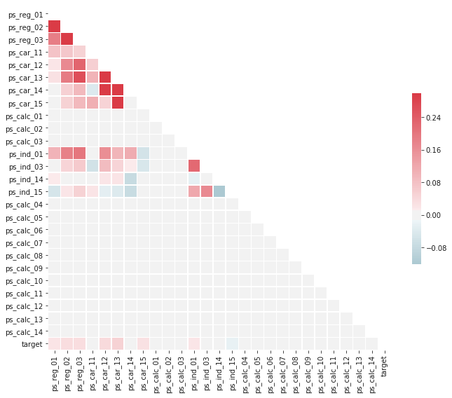
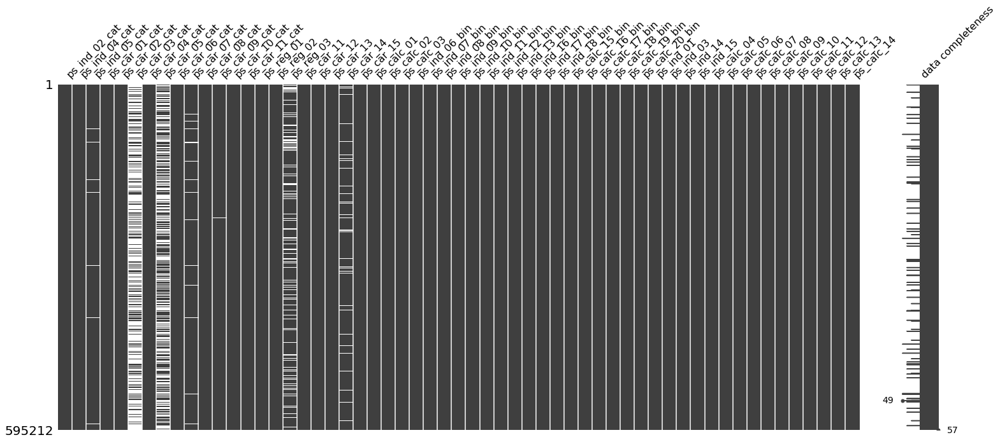
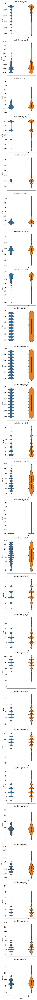
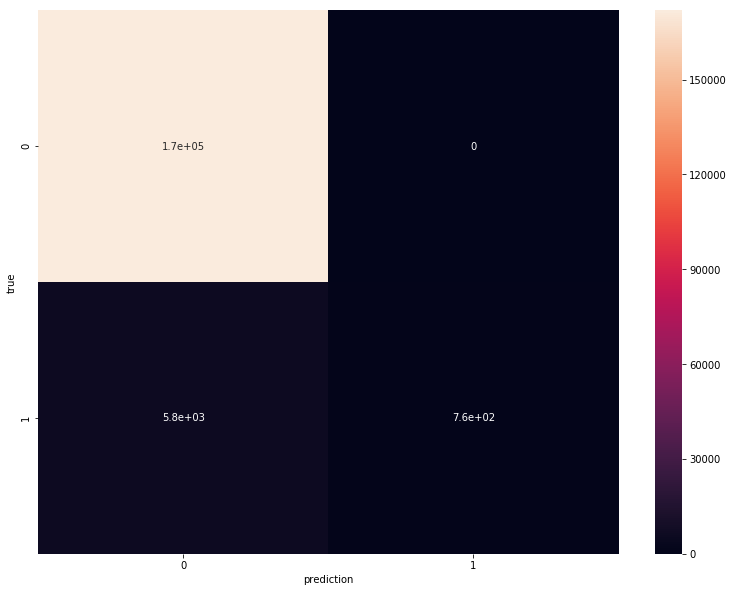
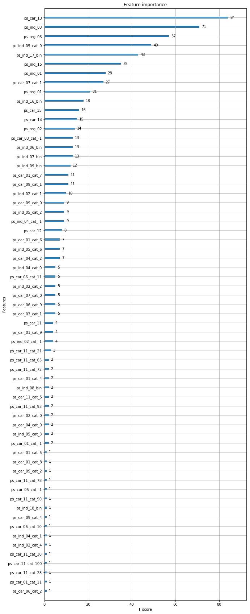

# Machine Learning Engineer Nanodegree
## Capstone Project
Paulo Roberto de Oliveira Castro
August 1st, 2018

## I. Definition
<!-- _(approx. 1-2 pages)_ -->

### Project Overview
Insurance is a data-driven business. Since it's beginning, it's possible to observe[[1]](https://web.archive.org/web/20060724173339/http://www.wiley.co.uk/eoas/pdfs/TAH012-.pdf) that the area was always focused on gathering information about a situation that involves risk (driving a car, having a house, etc.) and then measuring that risk, so it's possible to profit by assuming someone's risk and getting payed for that in exchange.

However, especially in Brazil, this is a rather expensive business for the final costumer. Buying new car, even if you're a very good driver, means a huge insurance spending. Sometimes it even prevents the costumer from buying it at all. Therefore, a good prediction about what is the real risk for a specific client means that the provider can charge a more reasonable amount of money for their insurance products. Machine Learning is therefore, one of the ways to achieve this[[2]](http://www.tandfonline.com/doi/full/10.1080/1331677X.2016.1175729)

 This project has origin on a Kaggle competition[[3]](https://www.kaggle.com/c/porto-seguro-safe-driver-prediction), from where we take a dataset provided by the insurance company Porto Seguro with dozens of features for more than five hundred thousand clients, alongside with a flag if that client claimed or not[[4]](https://www.kaggle.com/c/porto-seguro-safe-driver-prediction/download/train.7z).

<!-- In this section, look to provide a high-level overview of the project in layman’s terms. Questions to ask yourself when writing this section:
- _Has an overview of the project been provided, such as the problem domain, project origin, and related datasets or input data?_
- _Has enough background information been given so that an uninformed reader would understand the problem domain and following problem statement?_ -->

### Problem Statement

In this project we try to solve the problem of telling apart costumers that drive safely from those who don't based on the information held at the insurance company. To accomplish this, we will use several classification techniques from Machine Learning, including feature engineering and data cleaning steps.

First, we will explore the dataset and establish a benchmark solution, then proceed screening several classification algorithms. Then we will explore several approaches for data cleaning and feature engineering, measure their impact on the final result. After that we will also try to optimize the hyper-parameters of the chosen algorithms. After that, we will produce an ensemble of those models, such that the final answer overfits less the training set.  

The expected outcome of this project is a model ensemble, featuring several classification models and some data preprocessing steps. This kind of solution is widely used in Kaggle, being applied in most of the competition winners' solutions.

<!-- In this section, you will want to clearly define the problem that you are trying to solve, including the strategy (outline of tasks) you will use to achieve the desired solution. You should also thoroughly discuss what the intended solution will be for this problem. Questions to ask yourself when writing this section:
- _Is the problem statement clearly defined? Will the reader understand what you are expecting to solve?_
- _Have you thoroughly discussed how you will attempt to solve the problem?_
- _Is an anticipated solution clearly defined? Will the reader understand what results you are looking for?_ -->

### Metrics

The performance of our solutions will be assessed using the Gini Coefficient[[5]](https://en.wikipedia.org/wiki/Gini_coefficient), which can be computed as:

$$Gini = 2*AUC - 1$$

Where AUC is the area under the ROC curve as a proportion of the total area (which is one). In practice this means that the Gini Coefficient is the proportion of the area under the ROC curve and the total area, but only considering the region above the random line in the ROC. The Gini Coefficient of 1 indicates a perfect model, and of zero indicates one that performs as well as random guess. Less than that, the model performs worse than random guess. The area under the ROC curve is a very common way of measuring performance of binary classification tasks[[6]](http://home.comcast.net/~tom.fawcett/public_html/papers/ROC101.pdf), and the Gini Coefficient is a simple linear transformation of it.

The advantage of using this metric is that we have a clear benchmark, below which the answer is unacceptable (random guess), and also we would be able to measure our performance accounting for the target distribution on the test set. If the target distribution is highly skewed, metrics like accuracy would give an almost perfect score to solutions that simply guess the most common class. On the other hand, when using the Gini Coefficient we simply compute the false/true positive rates[[7]](https://en.wikipedia.org/wiki/Sensitivity_and_specificity#Definitions), which are insensitive to class imbalance.

<!-- In this section, you will need to clearly define the metrics or calculations you will use to measure performance of a model or result in your project. These calculations and metrics should be justified based on the characteristics of the problem and problem domain. Questions to ask yourself when writing this section:
- _Are the metrics you’ve chosen to measure the performance of your models clearly discussed and defined?_
- _Have you provided reasonable justification for the metrics chosen based on the problem and solution?_ -->

## II. Analysis
<!-- _(approx. 2-4 pages)_ -->

### Data Exploration

As mentioned before, we use the dataset provided by Porto Seguro, containing 57 features for 595212 clients, alongside with a flag if that client claimed of not. The data is anonymous: we can't neither get any information about the client (apart from an ID) nor from the features, since all of them are encoded and names in a way that it's impossible to guess its meaning.

Some information, however, is still present in the feature names. Features has part of the name indicating whether it's a individual features (with the string "ind" in the middle of the name), a feature about the car ("car") or a calculated feature, made by Porto Seguro based on other features ("calc"). Feature engineering can be hard, specially when we don't have the true meaning of the features, but we should be careful when using this kind of feature, as it may only introduce noise to some of our models (specially non-linear ones, that can discover those relations as part of the learning process).

Another information present in the names of the features in our dataset is its type. The suffix of the name indicates whether a feature is categorical (suffixed with "cat"), binary ("bin") or numeric (no suffix, and can be either a floating point or an integer feature). This raises another concern that we may address in our solution: categorical features (specially non-binary ones) often require some form of encoding -- if we encode these variables as numbers, we are implying order between the categories, which may not be the case.

A sample of the dataset is shown in the following table:

| id | target | ps_ind_01 | ps_ind_02_cat | ps_ind_03 | ps_ind_04_cat | ps_ind_05_cat | ps_ind_06_bin | ps_ind_07_bin | ps_ind_08_bin | ps_ind_09_bin | ps_ind_10_bin | ps_ind_11_bin | ps_ind_12_bin | ps_ind_13_bin | ps_ind_14 | ps_ind_15 | ps_ind_16_bin | ps_ind_17_bin | ps_ind_18_bin | ps_reg_01 | ps_reg_02 | ps_reg_03          | ps_car_01_cat | ps_car_02_cat | ps_car_03_cat | ps_car_04_cat | ps_car_05_cat | ps_car_06_cat | ps_car_07_cat | ps_car_08_cat | ps_car_09_cat | ps_car_10_cat | ps_car_11_cat | ps_car_11 | ps_car_12    | ps_car_13          | ps_car_14           | ps_car_15    | ps_calc_01 | ps_calc_02 | ps_calc_03 | ps_calc_04 | ps_calc_05 | ps_calc_06 | ps_calc_07 | ps_calc_08 | ps_calc_09 | ps_calc_10 | ps_calc_11 | ps_calc_12 | ps_calc_13 | ps_calc_14 | ps_calc_15_bin | ps_calc_16_bin | ps_calc_17_bin | ps_calc_18_bin | ps_calc_19_bin | ps_calc_20_bin |
|----|--------|-----------|---------------|-----------|---------------|---------------|---------------|---------------|---------------|---------------|---------------|---------------|---------------|---------------|-----------|-----------|---------------|---------------|---------------|-----------|-----------|--------------------|---------------|---------------|---------------|---------------|---------------|---------------|---------------|---------------|---------------|---------------|---------------|-----------|--------------|--------------------|---------------------|--------------|------------|------------|------------|------------|------------|------------|------------|------------|------------|------------|------------|------------|------------|------------|----------------|----------------|----------------|----------------|----------------|----------------|
| 7  | 0      | 2         | 2             | 5         | 1             | 0             | 0             | 1             | 0             | 0             | 0             | 0             | 0             | 0             | 0         | 11        | 0             | 1             | 0             | 0.7       | 0.2       | 0.7180703307999999 | 10            | 1             | -1            | 0             | 1             | 4             | 1             | 0             | 0             | 1             | 12            | 2         | 0.4          | 0.8836789178       | 0.3708099244        | 3.6055512755 | 0.6        | 0.5        | 0.2        | 3          | 1          | 10         | 1          | 10         | 1          | 5          | 9          | 1          | 5          | 8          | 0              | 1              | 1              | 0              | 0              | 1              |
| 9  | 0      | 1         | 1             | 7         | 0             | 0             | 0             | 0             | 1             | 0             | 0             | 0             | 0             | 0             | 0         | 3         | 0             | 0             | 1             | 0.8       | 0.4       | 0.7660776723       | 11            | 1             | -1            | 0             | -1            | 11            | 1             | 1             | 2             | 1             | 19            | 3         | 0.316227766  | 0.6188165191       | 0.3887158345        | 2.4494897428 | 0.3        | 0.1        | 0.3        | 2          | 1          | 9          | 5          | 8          | 1          | 7          | 3          | 1          | 1          | 9          | 0              | 1              | 1              | 0              | 1              | 0              |
| 13 | 0      | 5         | 4             | 9         | 1             | 0             | 0             | 0             | 1             | 0             | 0             | 0             | 0             | 0             | 0         | 12        | 1             | 0             | 0             | 0.0       | 0.0       | -1.0               | 7             | 1             | -1            | 0             | -1            | 14            | 1             | 1             | 2             | 1             | 60            | 1         | 0.316227766  | 0.6415857163       | 0.34727510710000004 | 3.3166247904 | 0.5        | 0.7        | 0.1        | 2          | 2          | 9          | 1          | 8          | 2          | 7          | 4          | 2          | 7          | 7          | 0              | 1              | 1              | 0              | 1              | 0              |
| 16 | 0      | 0         | 1             | 2         | 0             | 0             | 1             | 0             | 0             | 0             | 0             | 0             | 0             | 0             | 0         | 8         | 1             | 0             | 0             | 0.9       | 0.2       | 0.5809475019       | 7             | 1             | 0             | 0             | 1             | 11            | 1             | 1             | 3             | 1             | 104           | 1         | 0.3741657387 | 0.5429487899000001 | 0.2949576241        | 2.0          | 0.6        | 0.9        | 0.1        | 2          | 4          | 7          | 1          | 8          | 4          | 2          | 2          | 2          | 4          | 9          | 0              | 0              | 0              | 0              | 0              | 0              |
| 17 | 0      | 0         | 2             | 0         | 1             | 0             | 1             | 0             | 0             | 0             | 0             | 0             | 0             | 0             | 0         | 9         | 1             | 0             | 0             | 0.7       | 0.6       | 0.840758586        | 11            | 1             | -1            | 0             | -1            | 14            | 1             | 1             | 2             | 1             | 82            | 3         | 0.3160696126 | 0.5658315025       | 0.3651027253        | 2.0          | 0.4        | 0.6        | 0.0        | 2          | 2          | 6          | 3          | 10         | 2          | 12         | 3          | 1          | 1          | 3          | 0              | 0              | 0              | 1              | 1              | 0              |

Missing values is another concern we should have about this particular dataset. Some categorical and numerical data have missing values, with a total of thirteen features presenting this kind of issue. The number of missing values seems to vary (from a few percent up to more than 70% in one of the columns). There is some structure, however, in the way that the missing value work. The presence of missing values in one of the features may reduce or increase the chance that we see a missing value in other column. With all these properties, the way we will handle missing values may be of crucial importance for some algorithms.

When looking on the target distribution, we also find another characteristic to deal with in our problem: the dataset is highly unbalanced. The number of people how claims the insurance is much lower than the number of those who don't (only ~4% of the people claim). This unbalance means that we may see some problems with some algorithms. For example, techniques that has as loss function that don't distinguish errors from the most common and the less common target class may result in a model that only guess the most frequent target value. In our case, we would only miss ~4% of the value, but the Gini Coefficient would be low, since we never guess the least frequent target value correctly. To deal with this we could try and apply balancing techniques on the algorithm level or by under/super-sampling the original training set.

The distribution of the variables was also investigated. We looked for some ill-shaped distributions, containing outliers, as well as co-linear variables that could be redundant. However, when we look at the variables and their joint distributions, we found only 11% of the examples were outliers in at least on features (univariate outlier, and these examples could not be outliers when considering all variables at once). As of the joint distributions, we didn't find any specially co-linear variable. When dealing with linear methods, we shall remember this, as we could deal with this kind of situation by using a different loss function such as some regularization technique as adding the L1 norm to our loss function. However, when looking for correlation between numerical columns, we found that some of the variables (for example `ps_car_12` and `ps_car_13`) have high positive correlation while some (like `ps_ind_14` and `ps_ind_15`) have high positive correlation.

When inspecting the joint distribution between the variables and the target, we found that a significant number of variables have have different distributions depending of the target, but the difference is always very weak. This means that we shouldn't expect this classification problem to be easily solved. Those small effects should be more easily dealt with by using some non-linear technique as boosting or bagging.

<!-- In this section, you will be expected to analyze the data you are using for the problem. This data can either be in the form of a dataset (or datasets), input data (or input files), or even an environment. The type of data should be thoroughly described and, if possible, have basic statistics and information presented (such as discussion of input features or defining characteristics about the input or environment). Any abnormalities or interesting qualities about the data that may need to be addressed have been identified (such as features that need to be transformed or the possibility of outliers). Questions to ask yourself when writing this section:
- _If a dataset is present for this problem, have you thoroughly discussed certain features about the dataset? Has a data sample been provided to the reader?_
- _If a dataset is present for this problem, are statistics about the dataset calculated and reported? Have any relevant results from this calculation been discussed?_
- _If a dataset is **not** present for this problem, has discussion been made about the input space or input data for your problem?_
- _Are there any abnormalities or characteristics about the input space or dataset that need to be addressed? (categorical variables, missing values, outliers, etc.)_ -->

### Exploratory Visualization

First, as a manner to easily detect patterns in our data, we inspect the joint distribution of our variables. Taking a look at the numerical variables, we can see that most of them are conditionally independent, however we can detect dependencies in pairs like 'ps_calc_10' and 'ps_calc_08'. Those are indications that we have a high mutual information between those pair of variables, and that knowing one could be enough to detecting a pattern about the target.

Another way of detecting such redundancies is plotting a correlation matrix between those variables. This will give a more objective way of measuring the redundancies. As we can see, some variable are redundant and probably would add little to no information about the target on our models.

Another important information when modelling our problem is the distribution and amount of missing data we have on this dataset. We can't know if the missing data is missing at random, or the missingness have a meaning, but we can at least inspect its distribution before deciding the approach, specially since the models we tried handle missingness in different way.

The first plot is the distribution of missing data
 throughout the dataset. Here we can see that we have a lot of features without missing data, but a bunch of them do. We highlight `ps_car_03_cat` and  `ps_car_05_cat`, that are missing for most of the customers.

 

The data completeness column indicates that those missing values are most likely not missing at random, since most of the times the customer have not one, but several missing features at once.

Another important aspect to analyze about this problem is the joint distribution between features and targets. When we inspect those distributions we can see that on some variables (e.g. `ps_calc_01`) we have a clear difference between the dsitribution of the feature values when the class is positive and when the class is negative.

Inspecting this is important since we can have an insight about whether the problem is easy (most variables are have very differet distributions) or not. In this case, those relations are more nuanced.

We could have done the same plots for the categorial distribution, only to arrive at the same kind of conclusion.

<!-- In this section, you will need to provide some form of visualization that summarizes or extracts a relevant characteristic or feature about the data. The visualization should adequately support the data being used. Discuss why this visualization was chosen and how it is relevant. Questions to ask yourself when writing this section:
- _Have you visualized a relevant characteristic or feature about the dataset or input data?_
- _Is the visualization thoroughly analyzed and discussed?_
- _If a plot is provided, are the axes, title, and datum clearly defined?_ -->

### Algorithms and Techniques

This is a classic classification problem, and therefore, several classification algorithms can be used to solve it. The most basic one is the Logistic Regression. This linear model will use linear combinations of the features to predict the probability of each of the two target classes. While simple, it's very fast to train and will detect any simple linear pattern in the dataset. The logistic model models the probability of a sample $i$ as:

$$\operatorname{logit}(\mathbb{E}[Y_i\mid \mathbf{X}_i]) = \operatorname{logit}(p_i)=\ln\left(\frac{p_i}{1-p_i}\right) = \boldsymbol\beta \cdot \mathbf{X}_i$$

The algorithm basically works by finding the maximum likelihood for the samples, that is, maximizing $p(y|\beta, x)$. Also, it's very easy to interpret, since we can tell what happens to the target when changing one of the variables. When training a logistic regression, we are also able to add a regularization term to its loss function. If we use the L1 regularization term, the solution is most likely to be sparse. On the other hand, if we use the L2 term, we only force that each of the parameters of the linear model must be small, but not necessarily zero. On the other hand, the L2 regularization results in more robust solutions that the L1 regularization, while being more computationally efficient.

However, as we noted in the previous sections, a linear model shouldn't be able to explain the relation between the target and the features. Therefore, we will also test several non-linear models, such as boosting, bagging, neural networks and ensemble of many models.

Boosting models consist of iteratively learning weak models (usually decision trees) and then combining those weak models in a stronger learner. One example of this is the gradient boosting (implemented in XGBoost and LightGBM for example) in which each weak learner will fit the residual $y - F(x)$ of the current strong learner $F$. The optimization step is such that we compute the residuals for each sample, fit a new base learner $h$ to the residuals and compute the multiplier $\gamma$ so that:

$$\hat{F} = \sum_m \gamma_m h_m(x) + const$$

Another boosting technique used in this project is the AdaBoost, in which each weak learner are tweaked in favor of examples missclassified by previous learners. The optimization algorithm is similar to gradient boosting, but using an exponential loss $\sum_i e^{y_i f(x_i)}$.

Those models are nonlinear, since they use decision trees and ensemble techniques as learners, therefore they could better capture the patterns in our dataset. Also, this techniques effectively reduce bias (and variance) and can be better in generalizing to the test set.

Neural networks are non-linear models comprised of several layers, each computing linear combinations and using a non-linear function of top of that to compute its output:

$$\sigma({\sum_i{w_i x_i}}) = y_i$$

The coefficients of those linear combinations are optimized buy computing the gradients of a loss, in an hierarchical manner, and then descending the gradient. This minimizes the error, and achieves a local optima that tends to be similar to the global one. Neural networks achieved state of the art performance on machine learning problems related to sound and image classification, and play important role in new reinforcement learning techniques.

On the neural network side, we use entity embedding [[7]](https://arxiv.org/abs/1604.06737) to encode our categorical variables, allowing for fast neural network training. This technique was previously applied to classification problems and was able to reach third place in a competition with very simple features[[8]](https://github.com/entron/entity-embedding-rossmann/tree/kaggle).

Other algorithms will also be tested, like Random Forest and Support Vector Machines (RBF kernel). These models not only could improve our metrics alone, but could also be used in the final ensemble to improve generalization. The final model will be an ensemble of several of those models. This could reduce the variance and improve generalization a little bit, and is usually used in Kaggle competitions.

<!-- In this section, you will need to discuss the algorithms and techniques you intend to use for solving the problem. You should justify the use of each one based on the characteristics of the problem and the problem domain. Questions to ask yourself when writing this section:
- _Are the algorithms you will use, including any default variables/parameters in the project clearly defined?_
- _Are the techniques to be used thoroughly discussed and justified?_
- _Is it made clear how the input data or datasets will be handled by the algorithms and techniques chosen?_ -->

### Benchmark

As discussed earlier, the Logistic Regression is the most simple and interpretable linear model we can use for this sort of problem. Also, it is usually used by insurance companies while dealing with this kind of problem. Therefore, it will be our algorithm of choice for our benchmark.

However, this algorithm doesn't deal with missing values. Therefore we need to apply a very simple scheme to fill missing data. In this case, we will use the median of each feature in the training set to fill those values up. Other techniques will be tested in time.

The result we obtained was a Normalized Gini of -0.24, which means that it is worse than random guess. As a comparison, if we predict only good drivers, we reach a Normalized Gini of 0.005. To reach this result, we used the Logistic Regression implementation from the python library scikit-learn, using the default parameters. We used 70% of the dataset as training data, and 30% as test.

While bad, this result isn't much surprising. This problem was extracted from a Kaggle competition from an insurance firm, that usually uses this kind of technique. Therefore this should be a dataset to which Logistic Regression wasn't easily applicable, but a highly problematic one (so things would get interesting on the competition).

<!-- In this section, you will need to provide a clearly defined benchmark result or threshold for comparing across performances obtained by your solution. The reasoning behind the benchmark (in the case where it is not an established result) should be discussed. Questions to ask yourself when writing this section:
- _Has some result or value been provided that acts as a benchmark for measuring performance?_
- _Is it clear how this result or value was obtained (whether by data or by hypothesis)?_ -->

## III. Methodology
<!-- _(approx. 3-5 pages)_ -->

### Data Preprocessing

To reach our best result with Boosting, we first discard features calculated by Porto Seguro, which our non-linear algorithms must be able to figure out by themselves. This will reduce the ammount of features, reducing the variance. We also applied a target encoding to our categorical features [[9]](https://kaggle2.blob.core.windows.net/forum-message-attachments/225952/7441/high%20cardinality%20categoricals.pdf), since encoding them as numbers add a false sense of ordering to the categories. This method was found to be slightly better than a simple one-hot encoding (as we can see in notebook \#06)

After that, to each numeric feature we add a corresponding boolean one that states whether that feature is above or below the mean. We also create the same set of variables using the median as the reference value. Those values will simplify the encoding of the numeric features, simplifying the job of the decision trees (since they can now split on this boolean feature instead of guessing what value to split on).

To deal with missing data we could use some strategies. We could use the missing data as is (as supported by XGBoost and LightGBM implementations of Gradient Boosting) or fill the missing values with mean or median of the training set. After some tests (that can be found on notebook \#05), we find that the gradient boosting performed better by filling the missing values with the median of the training set, so this is what we applied in our final Boosting algorithm.

The dataset is highly unbalanced with respect to the target labels. To deal with this some balancing techniques were tested, such as undersampling, oversampling (SMOTE) and class weights, but none lead to an increase of the Gini metric (see notebook \#04).

For the entity embedding neural network, we used a label encoder to pre-encode the categorical features into integers, so that they would enter the neural network in the correct format. Also, we excluded categorical variables with only 2 or less possible values. After that, we only needed to ensure that the variables followed the same order defined in the neural network.

<!-- In this section, all of your preprocessing steps will need to be clearly documented, if any were necessary. From the previous section, any of the abnormalities or characteristics that you identified about the dataset will be addressed and corrected here. Questions to ask yourself when writing this section:
- _If the algorithms chosen require preprocessing steps like feature selection or feature transformations, have they been properly documented?_
- _Based on the **Data Exploration** section, if there were abnormalities or characteristics that needed to be addressed, have they been properly corrected?_
- _If no preprocessing is needed, has it been made clear why?_ -->

### Implementation

All the work, both experimentation and final models, were implemented in Jupyter notebooks using the Python language. This allows for flexibility to experiment and iterate over ideas in a fast manner, while keeping the report style clear and concise. Each test, from the exploratory analysis to the final model, was implemented in a separate notebook, and all of them are available alongside this report.

All data wrangling was done using the libraries Pandas (data loading, dealing with missing values and feature creation), scikit-learn (for transformations) and imbalance-learn (for dealing with the unbalanced target). Also, all the machine learning algorithms we used are available in scikit-learn, Keras (with Tensorflow backend), LightGBM and XGBoost libraries.

The metric used in this project wasn't available in any of those libraries. Therefore, a new implementation had to be provided. We used the same API used by scikit-learn metrics `gini_normalized(actual, pred)`. This allows for integration with all python libraries, which expect this kind of function signature. The implementation used in this work follows the one provided in this kernel[[10]](https://www.kaggle.com/tezdhar/faster-gini-calculation). This implementation is very fast and easy to read.

We also had to implement target encoding[[9]](https://kaggle2.blob.core.windows.net/forum-message-attachments/225952/7441/high%20cardinality%20categoricals.pdf). We used the concept of scikit-learn's transformers, and implemented this encoder as one. To use it, we can simply use the `fit` and `transform` methods on our data. As a possible complication, in this implementation, we only accept pandas's `DataFrame` as input, so it isn't fully compatible with Scikit Learn framework (altough it is close to that).

For the entity embedding part, following this implementation[[11]](https://www.kaggle.com/aquatic/entity-embedding-neural-net), we chose to implement the neural network using Keras. For each categorical feature, we built an embedding layer with a smaller dimensionality than the number of possible values for that categorical variable (e.g. if the variable had 10 possible values, we built an embedding with less than 10 dimensions). This was done using the `Embedding` layer from keras. For the other variables, we used simple `Dense` layers of 16 dimensions output. All of those were combined in a `Merge` layer and used as imput to a neural network of 4 layers with dropout. Since we are dealing with a binary classification problem we used the binary crossentropy as loss function and Adam as our optimizer given its fast convergence speed and overall result close to the best on several problems. The neural network was trained in a low-end GPU (NVIDIA GeForce 830M) in less than one hour.

<!-- Falar dos problemas como otimização de hiperparametros -->

<!-- In this section, the process for which metrics, algorithms, and techniques that you implemented for the given data will need to be clearly documented. It should be abundantly clear how the implementation was carried out, and discussion should be made regarding any complications that occurred during this process. Questions to ask yourself when writing this section:
- _Is it made clear how the algorithms and techniques were implemented with the given datasets or input data?_
- _Were there any complications with the original metrics or techniques that required changing prior to acquiring a solution?_
- _Was there any part of the coding process (e.g., writing complicated functions) that should be documented?_ -->

### Refinement

First (as seen in notebook \#3) we tried several algorithms contained in the Python library `scikit-learn`. We used the classifiers `RandomForestClassifier`, `KNeighborsClassifier`, `MLPClassifier`, `GradientBoostingClassifier`, `AdaBoostClassifier` and `SVC` from `sklearn`, all with default parameters. The `lightGBM` and `XGBoost` libraries' classifiers were also used with their default parameters. The result is that gradient boosting was indeed the best way to deal with this dataset, giving us the highest Normalized Gini (0.2700) when compared to algorithms like AdaBoost (0.2565), Random Forest (0.069), Multi-layer Perceptron (0.2407) and K-Nearest-Neighbors (0.0277).

For the boosting algorithm, we started with 0.2700 of Normalized Gini, without dealing with missing data, and also without categorical encoding or balancing the dataset. We proceeded to find the best way to deal with the unbalanced target, just to find that all of the techniques we tried (under-sampling, over-sampling with SMOTE or class weights) had no positive impact on the performance (notebook \#4). After experimenting with techniques of dealing with missing values, we found that filling with the mean would raise the result to 0.2718 of Normalized Gini (notebook \#5).

We then focused on the encoding of the categorical features (notebook \#6). We experimented with One-Hot Encoding, which had little to no impact on the models performance (possibly because of the way XGBoost deals with categorical features), but Target Encoding raised the performance up to 0.2728 of Normalized Gini.

 We proceeded to check whether feature normalization would affect performance (notebook \#7), and found that neither Standard Scaling, Robust Scaling, Max-Abs Scaling nor Min-Max Scaling lead to any improvements on this particular dataset. The same can be said about dimensionality reduction algorithms like PCA and truncated SVD (notebook \#8).

As the last step, we performed the implementation of a bagging ensemble model, so that our best solutions would be combined to create a better model. This was done by simply weighting the NNs, XGBs and Gradient Boosting scores with 0.4, 0.4 and 0.2 respectively. This tuning was done by either hand and by using a logistic regression on top of the scores. However, those hand-made values ended-up having the best score on the test set. The improvement with this technique was sensible, increasing predictive power while reducing overfitting.

<!-- In this section, you will need to discuss the process of improvement you made upon the algorithms and techniques you used in your implementation. For example, adjusting parameters for certain models to acquire improved solutions would fall under the refinement category. Your initial and final solutions should be reported, as well as any significant intermediate results as necessary. Questions to ask yourself when writing this section:
- _Has an initial solution been found and clearly reported?_
- _Is the process of improvement clearly documented, such as what techniques were used?_
- _Are intermediate and final solutions clearly reported as the process is improved?_ -->

## IV. Results
<!-- _(approx. 2-3 pages)_ -->

### Model Evaluation and Validation

After a series of Hyper-Parameter optimization steps for several models, we discovered that the best model for our problem is an ensemble of a Neural Network with an embedding layer (as described in the implementation section) with a Gradient Boosting model. The final neural network used in this is comprised of the empbedding layer (with a dense layer with 16 neurons), followed by 4 dense layers with 80, 20, 10 and 1 neuron respectively. All but the last layer had `relu` activation and a dropout rate varying from 0.35 for the first layer to 0.15 of the other two hidden layers. We used binary crossentropy as loss, and optimized with the ADAM algorithm. The Gradient Boosting was performed by using both the `scikit-learn` default implementation and the XGBoost library (all with default parameters as stated above). The ensemble was performed with a bagging algorithm, with the weights being decided by hand to be 0.4 for the NN, 0.4 for XGBoost and 0.2 for the `GradientBoostingClassifier`.

Using this setup, we arrived at a mean Normalized Gini of ~0.28 across several runs with different train/test splits.

This indicates that this specific model is robust, since changes to the train/test-set choices didn't affect the results that much. The result is a model that has a good generalization power, and tends to have the same performance on unseen data.

Those two models models (Neural Networks and Gradient Boosting) were chosen for the ensemble since they were very performant individually, but also because they are rather different models in the way they model the posterior distribution. This means that, when one of the models is bad at identifying a pattern on a particular region of the feature space, the other model could perform much better. Ensemble models are less prone to overfitting, since all of our models would have to agree before predicting the class of a data point.

It's important to see that the ensemble of the model was extremely important to reach such performance. No model alone could reach more than 0.275 consistently. However, by combining models that don't have much correlation between them, we can improve our predictive power while increasing our generalization capacity.

<!-- In this section, the final model and any supporting qualities should be evaluated in detail. It should be clear how the final model was derived and why this model was chosen. In addition, some type of analysis should be used to validate the robustness of this model and its solution, such as manipulating the input data or environment to see how the model’s solution is affected (this is called sensitivity analysis). Questions to ask yourself when writing this section:
- _Is the final model reasonable and aligning with solution expectations? Are the final parameters of the model appropriate?_
- _Has the final model been tested with various inputs to evaluate whether the model generalizes well to unseen data?_
- _Is the model robust enough for the problem? Do small perturbations (changes) in training data or the input space greatly affect the results?_
- _Can results found from the model be trusted?_ -->

### Justification

The model proposed in this work can be considered better than the benchmark when looking at the proposed validation metrics suggested by the authors of the Kaggle competition. The benchmark (a simple Logistic Regression) wasn't able to perform better than random guess, with a negative Normalized Gini, while the ensemble model was able to reach a Normalized Gini of 0.27, which indicates reasonable predictive power.

Both results are so different that is reasonable to affirm that the benchmark was beaten and, therefore, the purpose of this work was accomplished.
<!-- Fazer um teste de significancia -->

<!-- In this section, your model’s final solution and its results should be compared to the benchmark you established earlier in the project using some type of statistical analysis. You should also justify whether these results and the solution are significant enough to have solved the problem posed in the project. Questions to ask yourself when writing this section:
- _Are the final results found stronger than the benchmark result reported earlier?_
- _Have you thoroughly analyzed and discussed the final solution?_
- _Is the final solution significant enough to have solved the problem?_ -->

## V. Conclusion
<!-- _(approx. 1-2 pages)_ -->

### Free-Form Visualization

As a form of visualizing our results we are going to see how our predictions look like in the test data. Since our problem problem is binary, the predictions can be represented in what is called a confusion matrix: we plot a matrix with the number of occurrences in each quadrant, defined by the `true` label of the example and the `predicted` label.

In this case, we have a matrix that is highly skewed for the first quadrant, which is the `true` label 0 and the `predicted` label zero. Although this is a correct prediction, we don't want the model to predict always the same label. Luckly, in this case, we have a few cases of `true` label 1 and `predicted` label also 1, meaning that in some cases our model was able to make a correct positive prediction.

#### Confusion Matrix

It is also important to notice that this matrix was generated based on a choice of threshold, above which we consider the prediction score to result in positive label. In our case, we chose 0.5 just to exemplify the kind of prediction we make with this model, but when deploy a model like this we usually choose the threshold based on a business metric, such as the return of money that choosing a certain threshold would give us. Defining such a metric is beyond the scope of this project, but is certainly necessary to use this kind of model.

Also on the visualization of our results, an important metric to have is usually the importance of the features. We can see which features are more or less important and, based on that, we can decide whether it is worth it to keep or throw away a certain feature and what would be the impact of doing that on the model's performance.

In the case of the XGBoost model, one of the most important model of our stack, we can use the default implementation of feature importance to evaluate that. The metric used in this case (the default `weight` metric in XGBoost library, here called the `F score`), show how many times a tree from our boosting algorithm was split using this variable. Therefore, the higher the score, the more important is the variable.

While there are many other ways to measure the importance of a variable on an XGBoost model (using `gain`, `cover` or even libraries like `shap`), this metric is easy to grasp and usually enables the user to decide what feature are more or less important for the model.

<!-- In this section, you will need to provide some form of visualization that emphasizes an important quality about the project. It is much more free-form, but should reasonably support a significant result or characteristic about the problem that you want to discuss. Questions to ask yourself when writing this section:
- _Have you visualized a relevant or important quality about the problem, dataset, input data, or results?_
- _Is the visualization thoroughly analyzed and discussed?_
- _If a plot is provided, are the axes, title, and datum clearly defined?_ -->

### Reflection

In this work, we analyzed the problem of predicting a driver will initiate an auto insurance claim in the next year, based on information held by an insurance company. To accomplish this, we started with data exploration and benchmark models (logistic regression, which we use for comparison) to get a sense of the problem. Next we surveyed several well-known machine learning algorithms for this task and also applied several techniques for feature engineering and pre-processing. In this step we retained the best solutions for our problems so that we could build an ensemble model with the two best approaches: a neural network with an embedding layer and a gradient boosting model.

Difficult aspects of this problem are the target imbalance and the categorical natural of a large number of variables. In the first problem, we perceived that the imbalanced nature of the target didn't help very biased classification models since they could optimize accuracy by predicting the most common class. To circumvent this, we both used higher-variance models (such as Gradient Boosting and Neural Networks) and resampling techniques such as under sampling and SMOTE for over sampling. Those techniques are what enable us to reach higher Normalized Gini performance for this dataset.

On the second problem, we observed that a large number of features are categorical, but with a simple representation of those categories, the classification algorithms always have a hit performance-wise. The solution is to try to encode those variable so that we don't convey order between the classes while maintaining a less-redundant representation of the data. This is where the embedding network helped a lot. This model optimized the representation of the categorical features for the specific classification problem, leading to a simple and elegant solution with slightly better performance than the Gradient Boosting model, but without the high amount of feature engineering that this solution requires.

This kind of algorithm can be used whenever we have a a bunch of categorical features on an imbalanced dataset that a simple linear model can't be used for prediction. In special, our expectations for this solutions were met, although a larger distance between performances was expected.

<!-- In this section, you will summarize the entire end-to-end problem solution and discuss one or two particular aspects of the project you found interesting or difficult. You are expected to reflect on the project as a whole to show that you have a firm understanding of the entire process employed in your work. Questions to ask yourself when writing this section:
- _Have you thoroughly summarized the entire process you used for this project?_
- _Were there any interesting aspects of the project?_
- _Were there any difficult aspects of the project?_
- _Does the final model and solution fit your expectations for the problem, and should it be used in a general setting to solve these types of problems?_ -->

### Improvement

This work could be improved by going into hyper-parameter optimization more thoroughly: more parameter combination for the Gradient Boosting model, which is very slow and could take days or even weeks to optimize, but also the optimization of the neural network architecture. Adding more layers, performing more kinds of regularization, changing the objective functions and increasing training epochs could all lead to better performance of this model.

The representation of the categorical features could also be worked on. As the neural network model showed, this step is fundamental to the performance of the model. On possibility is using the representation found on the embedding layer of the neural network as input of other kind of model.

Another source of improvement could be in the ensemble of those models. The model weights could probably be improved, and other models could be also added to the mix, such as different neural networks and other kinds of boosting techniques. The last thing we could mention is the access to the meaning of those variables, so that our cleaning processed can be enhanced and we can get better insights on the patterns we can find in this data.

As seen in the Kaggle competition, many better solutions exist, but all public information on those solutions leads us to think that the general idea of solving this problem is basically the same that we applied in this work.

<!-- In this section, you will need to provide discussion as to how one aspect of the implementation you designed could be improved. As an example, consider ways your implementation can be made more general, and what would need to be modified. You do not need to make this improvement, but the potential solutions resulting from these changes are considered and compared/contrasted to your current solution. Questions to ask yourself when writing this section:
- _Are there further improvements that could be made on the algorithms or techniques you used in this project?_
- _Were there algorithms or techniques you researched that you did not know how to implement, but would consider using if you knew how?_
- _If you used your final solution as the new benchmark, do you think an even better solution exists?_

-----------

**Before submitting, ask yourself. . .**

- Does the project report you’ve written follow a well-organized structure similar to that of the project template?
- Is each section (particularly **Analysis** and **Methodology**) written in a clear, concise and specific fashion? Are there any ambiguous terms or phrases that need clarification?
- Would the intended audience of your project be able to understand your analysis, methods, and results?
- Have you properly proof-read your project report to assure there are minimal grammatical and spelling mistakes?
- Are all the resources used for this project correctly cited and referenced?
- Is the code that implements your solution easily readable and properly commented?
- Does the code execute without error and produce results similar to those reported? -->
